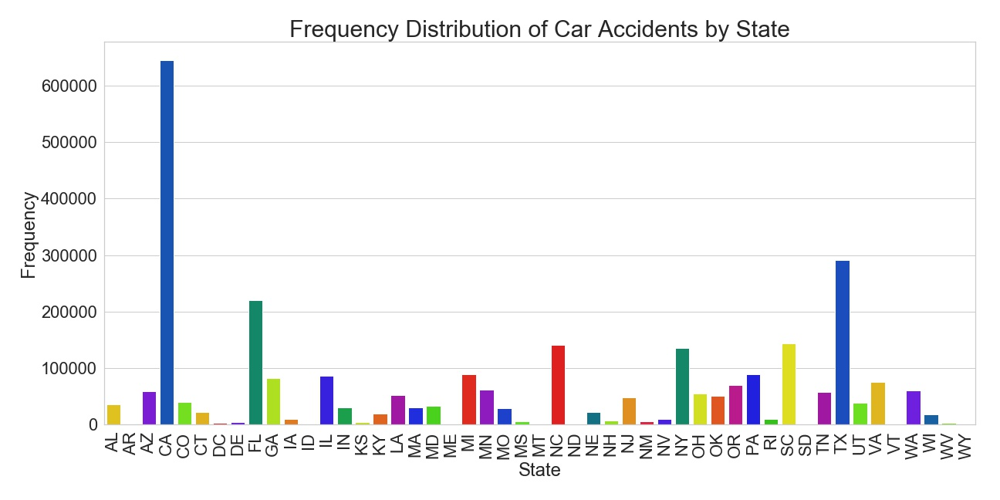

# Determining Severity of Vehicle Collisions in the U.S.

Exploratory data analysis and machine learning model development of nationwide dataset on U.S. car accidents.

## Description

The **goal of this project** is to investigate trends in U.S. car accidents and use it to develop a machine learning regression model that will predict the likely severity of collision if it were to occur in a particular city. The severity is quantified within a range of **1 to 4** (1 being the least severe or least impact).

## Data Source

The dataset is a nationwide traffic accident record of 49 U.S. states between Feb. 2016 to Dec. 2019. It was obtained from Sobhan Moosavi, Srinivasan Parthasarathy, Mohammad Hossein Samavatian, Rajiv Ramnath, researchers from Ohio State University who wrote a [paper](https://arxiv.org/pdf/1906.05409.pdf) describing vehicle accidents in the country under a grant from the Ohio Supercomputer Center. The researchers purposely released the dataset to the public in order to democratize its utility for machine learning model development by interested individuals. It contains 49 features and 2,974,335 data points. You can find it [here](https://smoosavi.org/datasets/us_accidents).

## Exploratory Data Analysis

### Vehicular accidents usually imposed "manageable" delay upon commuters during the specified time period with Class 2 Severity occuring the most nationwide

### Frequency Distribution of U.S. Accidents by State

### World cloud showing U.S. cities that experienced the most vehicular accidents

## Model Development

## Conclusion